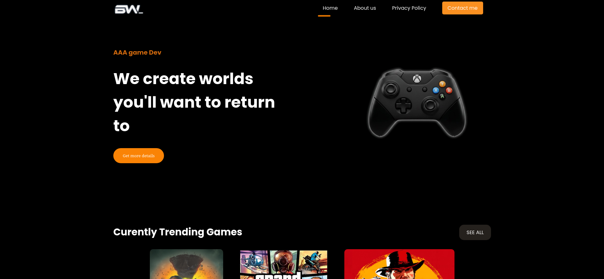

# Modern Portfolio Website 🚀

  
  
  

---

### 🌟 Overview
This is a high-end personal portfolio website designed to showcase web development skills and projects. The focus of this project is on **sleek design**, **smooth performance**, and **full responsiveness** across all devices.

### 🛠 Tech Stack
* **HTML5** – Structured semantic markup.
* **CSS3** – Advanced styling with Flexbox, Grid, and Animations.
* **Vercel** – High-performance hosting and deployment.

---

  
View site overview
   
  
[See site overview](https://youtu.be/k_lBUjypsfU?feature=shared)

---

### 🔒 Source Code Privacy
> [!NOTE]  
> This repository is used for **demonstration purposes only**. The source code is kept in a **private repository** to protect intellectual property and sensitive configurations.

---

Built with precision and passion for clean code.

